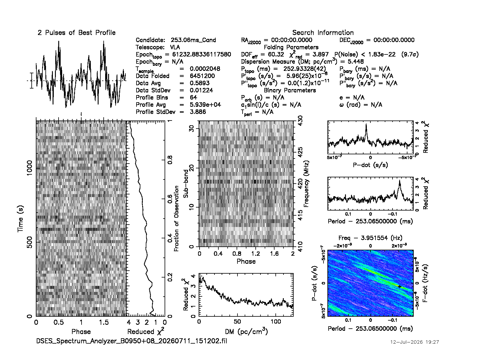

# Executive Summary

On Saturday, July 11, 2026, a DSES team — **Ray Uberecken (AA0L), Anne Haney (W0ZDW), and Richard Hambly (K0GD)** — conducted the Society's first live pulsar observing session using our own **DSES Spectrum Analyzer** software. The trip had a specific purpose: to demonstrate that members who are *not* pulsar-processing experts can plan an observation, capture pulsar data, and process it into professional-quality reports using the new software. That demonstration succeeded. Two bright pulsars were recorded through the 60-foot dish at the Haswell, Colorado site with an Ettus USRP B210 software-defined radio, and both were subsequently **detected with high statistical confidence**:

| Pulsar | Period | Detection significance |
|---|---|---|
| B0329+54 | 714.5 ms | ~20 sigma (probability of noise < 5×10⁻⁹⁰) |
| B0950+08 | 253.1 ms | ~10 sigma (probability of noise < 2×10⁻²²) |

These results validate the Society's complete, in-house data path end to end: **antenna → SDR → live filterbank recording → professional pulsar analysis (PRESTO)** — on real dish data, with software DSES wrote and controls.

Over the three-day span (Saturday July 11 – Monday July 13) the team also:

- **Reproduced both detections independently on two different computers** (macOS and Windows) running separately built copies of the PRESTO pulsar toolkit — the results agree to three significant figures, a strong cross-check of both the data and the analysis chain.
- **Root-caused and permanently fixed** the Linux field computer's user-interface problems (dead dropdown menus, misplaced windows), which turned out to be a Linux headless-display condition, not an application bug.
- **Released Spectrum Analyzer v1.1.6**, bundling the features requested in the field: a wide-band Sweep mode for RFI surveys, and recording enhancements that stamp each observation with its source name and coordinates.
- **Extended pulsar processing to the Windows platform** (previously Linux/Mac only), giving DSES redundant, reproducible analysis capability on multiple development machines.
- Brought **every test computer and the public release channel** up to the verified 1.1.6 baseline.

# Purpose — Lowering the Barrier to Radio Astronomy

For many years, the Society's radio-astronomy results have rested on the expertise of two members: **Dr. Richard Russel (AC0UB)** and **Dan Layne (AD0CY)**. The toolchain they mastered is the professional one, and it is demanding. Pulsar work at the site has meant a transportable Linux workstation running **PRESTO** and **TEMPO** built from source (with hand-edited observatory coordinate and clock files), Dan's custom **GNU Radio** filterbank flowgraphs driving the B210, the **SIGPROC** filterbank utilities, Breakthrough Listen's **blimpy/watutil** for RFI and saturation checks, and the I0NAA planning and analysis tools (**Murmur** and **Best Profile Analyzer**, run under Wine) — plus Stellarium and, above all, the experience to know how the pieces fit together. DSES's own training materials for this stack run to hundreds of pages. It produces first-rate results, but the learning curve has effectively limited hands-on pulsar observing to our two experts.

A few months ago, **Ray Uberecken and Richard Hambly** decided to pursue that same level of dedication to radio astronomy without requiring every observer to first master the full professional toolchain. Hambly began developing new software to consolidate the work done on site — planning the observation, choosing clean frequencies, verifying the RF path, and capturing analysis-ready data — into a single, easy-to-use package: the **DSES Spectrum Analyzer**. The name now undersells it: what began as an RFI-survey instrument has grown into a radio-astronomy data-acquisition system.

This trip was the deliberate test of that premise: could members who are not pulsar-processing experts use the new software to capture pulsar data and produce reports comparable to those Dan and Rich have delivered in the past? The answer — documented in this report — was **yes**. The session simultaneously produced a list of practical upgrades to make the software still more capable for the next trip; all of them shipped in version 1.1.6 within two days (below). With a roster of members now signed up for a radio-astronomy interest group, the Society is positioned to begin training new observers on a far gentler learning curve.

# The DSES Spectrum Analyzer

The DSES Spectrum Analyzer is a cross-platform (Windows / macOS / Linux) spectrum-analyzer and data-acquisition application developed within the Society. It drives the Ettus USRP B210 and a range of other software-defined radios, and was originally built to investigate radio-frequency interference (RFI) at the Haswell site. It has since grown into a pulsar data-acquisition tool: it can channelize the radio's stream in real time and write industry-standard SIGPROC filterbank (`.fil`) files — the input format consumed by PRESTO, the pulsar search and analysis toolkit used throughout the professional community.

The software is distributed from the Society's server with a built-in update checker, so observatory and member machines converge on each new release automatically. The field station at Haswell includes a Linux Raspberry Pi 5 ("drift-scan box") that runs the same application and is reachable remotely for support.

# Observations — July 11, Haswell

Two pulsars were recorded live to filterbank format through the 60-foot dish. Both recordings used the same geometry: **20 MHz of bandwidth centered on 420 MHz, 256 frequency channels, 204.8 µs time resolution**, 32-bit samples.

| Target | Start (MDT) | Duration | Data volume | Selection rationale |
|---|---|---|---|---|
| B0329+54 | 14:17 | 36.6 min | 11.0 GB | Brightest northern pulsar; the standard reference source |
| B0950+08 | 15:12 | 22.2 min | 6.7 GB | Bright, low-dispersion pulsar; was transiting (~59° altitude) during the session |

Target selection was performed live by computing current altitude/azimuth for the catalog pulsars from the Haswell site; most southern catalog sources are unobservable from the site's latitude, which made the transiting B0950+08 the natural second target.

# Results — Both Pulsars Detected

Each recording was processed with PRESTO's `prepfold`, which dedisperses the data (correcting the frequency-dependent arrival delay imposed by the interstellar medium), corrects arrival times to the solar-system barycenter, folds the data at the pulsar's spin period, and searches the surrounding period/dispersion space for the statistically best solution.

| Target | Fold type | Result |
|---|---|---|
| B0329+54 | Topocentric at known period/DM | ~20.1 sigma |
| B0329+54 | Barycentric, against the published ephemeris | ~19.9 sigma |
| B0329+54 | Blind search (period, period-derivative, and DM all searched) | 20.6 sigma, best DM ≈ 25 (catalog: 26.8) |
| B0950+08 | Topocentric at known period/DM | ~9.7 sigma |
| B0950+08 | Barycentric, against the ephemeris | ~9.8 sigma |

**B0329+54 is an unambiguous, textbook detection.** The folded profile shows the pulsar's characteristic double-peaked shape, the signal persists across the entire observation, and — critically — the detection strength peaks at a dispersion measure of ~25 pc/cm³, close to the catalog value of 26.8 and falling off toward zero. Dispersion is imposed by the interstellar medium; terrestrial interference shows none. This single curve separates a real pulsar from RFI.

**B0950+08 is also genuinely detected**, at ~10 sigma. One instructive subtlety: with only 20 MHz of bandwidth at 420 MHz, the analysis cannot sharply distinguish this pulsar's very low dispersion measure (2.97) from zero, so a blind search "slides" toward DM 0 and superficially resembles interference. Folding at the known period resolves the question — the periodicity is unmistakably the pulsar. B0950+08 also scintillates strongly (its apparent brightness varies as interstellar plasma focuses and defocuses it), so a longer follow-up observation is recommended.

## Independent cross-platform verification

The same recordings were processed twice, on independently built analysis stacks:

- **macOS** — PRESTO v5.0.2, and again on the newly built PRESTO v6.0.0
- **Windows** — PRESTO v6.0.0 running under Windows Subsystem for Linux (a new DSES capability, below)

Running identical fold commands on both platforms produced identical results to three significant figures (e.g., B0329+54 topocentric: probability-of-noise 4.49×10⁻⁹⁰ on Windows vs. 4.5×10⁻⁹⁰ on the Mac). Two machines, two operating systems, two separately compiled toolchains, one answer — the detections and the recording format are solid.

# Field Engineering — Drift-Scan Box Fixed

During the session the field Linux Raspberry Pi 5 exhibited unusable dropdown menus, a blank Help menu, and a window that opened tiny in the corner of the screen. Remote diagnosis (over the site's Tailscale network) traced every symptom to a single root cause: the box runs **headless** — no monitor is attached, and it is viewed over remote desktop — and with no connected display the graphics system reports a **0×0-pixel screen**, which collapses every popup menu and confuses window placement. This was a display-configuration condition, not an application defect, and it had silently affected every prior software version.

The permanent fix ships in v1.1.6: at startup the launcher now synthesizes a virtual monitor when none is connected, and the application declines to reposition windows against an empty screen. The field box was verified running the released fix.

# Software Release — Spectrum Analyzer v1.1.6

Version 1.1.6 was cut and published on July 12, bundling the work driven by this field session:

- **Sweep mode** — a stepped wide-spectrum scan mode for RFI surveys spanning more than the radio's instantaneous bandwidth. The radio retunes across a user-set range (e.g., 100–1000 MHz) and stitches each step into one wide trace, with cross-pass max-hold. This restores and extends a capability lost from an earlier development branch, and its absence was noticed at the site.
- **Recording enhancements** — an optional source name that is stamped into the output filename *and* the filterbank header (with right ascension/declination derived from the pulsar designation, so analysis tools receive proper metadata); a red REC indicator with elapsed time; and an optional timed recording with countdown and auto-stop. These directly address friction encountered while observing on July 11 — those first recordings had to be renamed and their headers patched by hand.
- Linux headless fixes (previous section), plus the associated documentation and operating-guide updates.

One day after release, the field box exposed a cross-platform packaging defect: the release archive, built for the first time on Windows, carried Windows-style line endings in the Unix launcher script, which prevented the application from starting on Linux and macOS. The archive was rebuilt and republished within hours, two independent safeguards were added to the build pipeline so the condition cannot recur, and every known installation was verified on the corrected build. The episode is a good illustration of the value of running real installations at the site — the field box surfaced in one day what desktop testing had missed.

# Processing Infrastructure — Pulsar Analysis on Every Machine

PRESTO and the associated pulsar timing tools (TEMPO, TEMPO2) are Unix-native software with no Windows version. During this effort the full toolchain was brought up on the Windows development machine via the Windows Subsystem for Linux, and the Mac was upgraded to the current PRESTO 6. Both installations are captured as re-runnable build scripts in the Society's source repository, along with the pulsar ephemerides used for barycentric folds and a maintenance script for the Earth-rotation data those folds require.

Practical effect for DSES: recordings can now be validated minutes after capture on whichever machine is at hand — in the field or at home — using identical, documented procedures, and every fold produces a standardized PDF diagnostic stored alongside the recording.

# Next Steps

1. **Publish** this report on the DSES web site.
2. **SARA conference** — prepare a slide presentation from this material.
3. **Begin training the radio-astronomy interest group.** A roster of interested members is in hand, and the new software substantially lowers the barrier to a first observing session.
4. **Re-observe B0950+08** with a longer integration (scintillation), and begin repeat observations of B0329+54 toward timing-grade data (pulse arrival times over a long baseline).
5. **Continue Spectrum Analyzer development** — additional features are planned; this document and the operating guide form the baseline that future releases will update.

# Acknowledgments

Software development, field diagnosis, and data processing were accelerated substantially by AI-assisted engineering (Claude Code – Opus 4.8 and Fable 5 engines) working alongside the author across the Society's Windows, macOS, and Linux machines.
